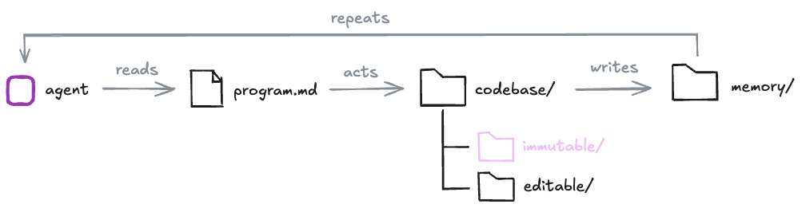

# research-loops-self-improvement

In this solo project, I run experiments on recursive self-improvement with coding agents. I believe the ingredients are in place, we just need to explore.

I set up a harness where a coding agent receives instructions via a markdown file, acts on a codebase, and is evaluated against an immutable test suite. It can curate artifacts and compound knowledge across multiple research loop iterations. Throughout this project, I test variations across each degree of freedom and investigate research questions as evidence accumulates. The project is structured in batches of experiments, each defined by: (1) a question being addressed, (2) an experimental setup and the number of runs required, and (3) evaluation criteria. I document experimentation, results, and technical details as I go. The format may evolve, as this is itself an experimental setup. I am a self-improving agent running experiments on self-improving agents. I love the dualism.

There are 4 degrees of freedom in these experiments: (1) the coding agent (the optimizer), (2) the program.md instructions (the config, hyperparameters, etc.), (3) the codebase, split into paths the agent can modify (the search space and initial conditions) and paths it cannot (e.g. the loss function), and (4) the memory the agent curates across iterations (artifacts and checkpoints).
