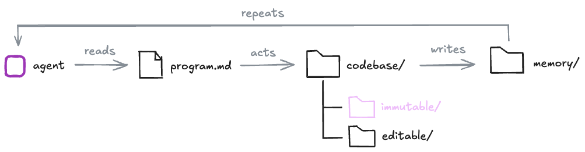

# research-loops-self-improvement.

In this solo project, I run experiments on recursive self-improvement with coding agents. I believe the ingredients are in place, we just need to explore.

I set up a harness where a coding agent receives instructions via a markdown file, acts on a constrained research-loop workspace, and is evaluated against an immutable test suite. It can curate artifacts and compound knowledge across multiple research loop iterations. Throughout this project, I test variations across each degree of freedom and investigate research questions as evidence accumulates. The project is structured in batches of experiments, each defined by: (1) a question being addressed, (2) an experimental setup and the number of runs required, and (3) evaluation criteria. I document experimentation, results, and technical details as I go. The format may evolve, as this is itself an experimental setup. I am a self-improving agent running experiments on self-improving agents. I love the dualism.

There are 4 degrees of freedom in these experiments: (1) the coding agent (the optimizer), (2) the `program.md` instructions (the config, hyperparameters, etc.), (3) the `research-loop/` workspace, split into paths the agent can modify (the search space and initial conditions) and paths it cannot (e.g. the loss function), and (4) the memory the agent curates across iterations (artifacts and checkpoints).

## project design.

- **agent**: I test different models.
- **research-loop/**: the agent-visible workspace. It contains the editable training code, immutable runner/evaluator code, `program.md`, and the fixed `uv` environment.
- **program.md**: the instruction file is kept minimal and close to a simple autoresearch loop. It tells the agent how to run experiments, log results, and handle existing workspace state.
- **_evals/**: swappable evaluation conditions. The harness copies the selected `eval.py` into `research-loop/immutable/eval.py`.
- **harness/**: host-side Docker and SSH-GPU orchestration code.
- **memory/**: artifacts and checkpoints curated by the agent. I start with the simplest `results.tsv` file as in Karpathy autoresearch.

## research loop structure.

- **editable/**: the only directory the agent may modify. It currently contains `config.toml`, `config_loader.py`, and `train.py`.
- **immutable/**: code the agent may run but not change. It contains `prepare.py`, `run_experiment.py`, and the injected `eval.py`.
- **run_experiment.py**: imports `editable.train`, trains the model in memory, evaluates it with the immutable evaluator, writes `memory/results.tsv`, and records `keep`, `discard`, or `crash`.
- **pyproject.toml** and **uv.lock**: the fixed dependency surface for each run.

## run protocol.

- each coding-agent run has approximately 4 hours.
- the agent proposes and runs one experiment at a time.
- each experiment gets a fixed 3-minute wall-clock training budget on a single GPU, excluding startup and compilation.
- if the coding agent exits mid-run, the harness starts a new agent session in the same workspace.
- each run is isolated: the harness creates a separate workspace copy, injects the selected evaluator, reuses shared environment/data paths when enabled, launches training, monitors limits, and archives outputs/logs/artifacts.
- the agent is allowed to edit only the editable workspace files, including `config.toml`, `config_loader.py`, and `train.py`. The immutable evaluator and data-preparation area are intended to be out of scope.
- the harness creates a new `memory/` directory where the agent can curate artifacts. It can also inherit artifacts from a previous run, allowing new runs to start from an existing checkpoint.

## harness.

- `docker_harness.sh` is the root entrypoint. It runs `python -m harness` through `uv`.
- each run gets an isolated workspace under `.local/docker-harness/<run-id>/research-loop`.
- the selected agent auth/config directory is copied into a per-run `/agent-home` mount. SSH keys and SSH config stay on the host.
- Docker receives the isolated workspace, `/agent-home`, and a local broker URL/token.
- inside Docker, generated `uv` and `git` wrappers keep the agent interface normal while intercepting `immutable/run_experiment.py` calls.
- the host GPU broker receives those experiment requests and runs them on the SSH GPU machine. In `--smoke` mode it skips SSH and writes synthetic local results.
- completed runs are archived under `docs/experiments/<job-name>-<run-id>/` with logs, metadata, results, and a resumable workspace snapshot.

## key differences from Karpathy's autoresearch.

1. **project structure:** each experiment workspace contains:
a) an `immutable/` directory with `prepare.py`, `run_experiment.py`, and the injected `eval.py` file for the given condition. The agent cannot modify these files.
b) an `editable/` directory with all code the agent is allowed to change: `config.toml`, `config_loader.py`, and `train.py`. The `train.py` is closely based on Karpathy's codebase.
c) `program.md`, `pyproject.toml`, and `uv.lock` for the fixed `uv` environment.
2. **single immutable runner:** `run_experiment.py` imports the editable trainer, runs evaluation in memory, enforces the wall-clock limit, and writes `memory/results.tsv`.
3. **swappable evaluator:** evaluator variants live in `_evals/`, and a different version is injected into `immutable/eval.py` depending on the experimental condition.
4. **more general config file:** The config exposes more knobs than Karpathy's original, making it easy to maintain a golden config for comparison and giving clear human-readable control over all experimental variables. All defaults have been removed from the training run — every parameter must be explicitly set. This makes the config a parameterized experiment harness rather than a compact baseline with hardcoded choices. Newly configurable parameters include: MLP width, weight initialization, rotary embeddings, logit softcap, `ignore_index`, and additional optimizer settings.
5. **simplified model architecture**, to keep the codebase minimal and reduce complexity for the agents:
a) plain PyTorch SDPA, with no separate K/V head counts, no GQA/MQA sharing, no FlashAttention-3, and no sliding-window attention.
b) no learned residual mixing.
c) no value embeddings or ResFormer-style value residuals.
6. **revised `program.md` structure**, while preserving its minimal character:
a) rules stated upfront.
b) redundancy removed throughout.
c) clear instructions on how to run an experiment and how to handle a non-empty workspace (i.e., when memory from previous runs is already present).
